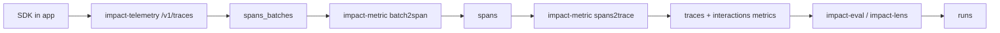

This page maps platform concepts to the current backend and frontend architecture.

## Core Hierarchy

Impact AI organizes runtime data in this order:

```text
Workspace
└── Product
    └── Version
        └── Interaction
            └── Trace
                └── Span
```

Evaluation output is stored as **Runs**, keyed by version/module/interaction.

## Entity Definitions

| Entity | Meaning |
|---|---|
| `workspace` | Tenant boundary with isolated schema and data |
| `product` | AI app or feature under evaluation |
| `version` | Deployable configuration of a product (and API key scope) |
| `interaction` | Session-level exchange, linked to an end user |
| `trace` | Logical execution record for a request/conversation step |
| `span` | Operation within a trace (LLM call, tool, retrieval, workflow step) |
| `run` | Evaluation/classification result from a module |

## Module System

Modules define what gets evaluated.

Common module types in the schema/service layer:

- `impact_eval`: scoring modules (for example one-to-five and flag)
- `impact_lens`: tagging/classification modules
- `impact_metric`: trace/interaction metric projections
- `impact_persona`, `impact_synt`, `impact_simulation`: synthetic generation workflows

## Processing Pipeline



## Product Surfaces (Frontend)

- **Analyse**: monitor, datasets, module catalog, and issues
- **Context**: strategy and framework metadata structure
- **Verify**: quality/capabilities/outcomes evaluation views
- **Impact Studio**: module authoring and tool-assisted workflows

## Tools vs Agents

Older agent-centric documentation has been replaced by service/tool-centric flows.

Current first-class tool APIs in Impact Studio include:

- `POST /api/v1/tools/deep_research`
- `POST /api/v1/tools/scoring_preview`
- `POST /api/v1/module_management/store_module`

See [Tools Overview](/tools/overview) for current service responsibilities.

## Next Steps

<CardGroup cols={2}>
  <Card title="Products & Versions" icon="cube" href="/platform/products">
    Workspace onboarding, versioning, and API key scope.
  </Card>
  <Card title="Modules" icon="puzzle-piece" href="/platform/modules">
    Eval and lens modules, run generation, and status.
  </Card>
</CardGroup>
