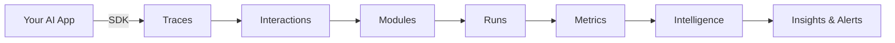

This page explains the key concepts in Impact AI and how they relate to each other.

## Core Hierarchy

Impact AI organizes your AI products in a hierarchical structure:

```
Product
└── Version
    └── Module
        └── Run
```

<AccordionGroup>
  <Accordion title="Product" icon="cube">
    A **Product** represents your AI application — whether it's a chatbot, agent, RAG system, or any GenAI-powered feature.
    
    Each product has metadata like name, description, owner, and status (Build, Available, Deprecated).
    
    **Example:** "Customer Support Agent", "Document Q&A Bot", "Code Assistant"
  </Accordion>
  
  <Accordion title="Version" icon="code-branch">
    A **Version** is a specific configuration or deployment of your product. Versions allow you to:
    
    - Track changes over time
    - Compare performance between releases
    - Run A/B tests between configurations
    
    Each version has its own API key for trace ingestion.
    
    **Example:** "v1.0.0", "v2.0-beta", "production", "staging"
  </Accordion>
  
  <Accordion title="Module" icon="puzzle-piece">
    A **Module** is an evaluation criterion or metric definition. Modules define *what* you're measuring about your AI's performance.
    
    There are two primary module types:
    
    - **Impact Eval** — LLM-as-a-judge evaluations (scores 1-5, pass/fail, custom rubrics)
    - **Impact Lens** — Classification and tagging (topic detection, intent recognition)
    
    **Example:** "Response Helpfulness", "Hallucination Detection", "Topic Classification"
  </Accordion>
  
  <Accordion title="Run" icon="play">
    A **Run** is a single evaluation result. When a module evaluates an interaction, it produces a run containing:
    
    - The evaluation result (score, label, or flag)
    - Confidence level
    - Reasoning/explanation
    
    Runs are aggregated to produce metrics, trends, and insights.
  </Accordion>
</AccordionGroup>

## Telemetry Concepts

Impact AI captures telemetry from your AI application using OpenTelemetry:

<AccordionGroup>
  <Accordion title="Trace" icon="route">
    A **Trace** represents a complete request through your AI system. It captures:
    
    - Input (user message)
    - Output (AI response)
    - All intermediate steps (LLM calls, tool invocations, retrievals)
    - Timing, tokens, and costs
    
    Traces are automatically enriched with 50+ metrics including duration, token usage, cost, and component analysis.
  </Accordion>
  
  <Accordion title="Span" icon="brackets-curly">
    A **Span** is a single operation within a trace. Spans form a tree structure showing the execution flow.
    
    Common span types:
    - `gen_ai.chat` — LLM completion calls
    - `retrieval` — Vector database queries
    - `tool` — Function/tool invocations
    - `agent` — Agent orchestration steps
  </Accordion>
  
  <Accordion title="Interaction" icon="messages">
    An **Interaction** groups related traces into a conversation or session. It's identified by `interaction_id` and typically represents:
    
    - A chat conversation (multiple back-and-forth messages)
    - A user session
    - A workflow execution
  </Accordion>
</AccordionGroup>

## Intelligence Concepts

Impact AI processes your telemetry and evaluation data to generate intelligence:

<AccordionGroup>
  <Accordion title="Metrics" icon="chart-line">
    **Metrics** are quantitative measurements derived from runs. Each module produces metrics like:
    
    - **Result** — The primary aggregated score (average, count, etc.)
    - **Flag** — Boolean indicator for pass/fail criteria
    - **Alert** — Triggered when metrics cross thresholds
    - **Confidence** — Aggregated evaluation confidence
    
    Metrics support histograms, time series, and change detection.
  </Accordion>
  
  <Accordion title="Insights" icon="lightbulb">
    **Insights** are AI-generated observations about your product's performance. They identify:
    
    - Trends (improving, degrading, stable)
    - Anomalies (unusual patterns)
    - Opportunities (areas for improvement)
    
    Insights are generated by analyzing metrics across modules and time periods.
  </Accordion>
  
  <Accordion title="Alerts" icon="bell">
    **Alerts** notify you when metrics cross defined thresholds. Configure alerts to:
    
    - Detect quality degradation
    - Monitor error rates
    - Track specific behaviors
    
    Alerts can be configured per-module with customizable sensitivity.
  </Accordion>
</AccordionGroup>

## Platform Structure

The Impact AI platform is organized into functional areas:

| Area | Purpose | Key Features |
|------|---------|--------------|
| **Analyse** | View and explore your data | Traces, interactions, datasets |
| **Verify** | Test and evaluate quality | Simulations, synthetic users, personas |
| **Context** | Configure evaluation framework | Pages, widgets, modules |
| **Impact Studio** | Build custom modules | Visual module builder with AI assistance |
| **Connectors** | Manage knowledge sources | Documents, integrations |
| **Govern** | Control and compliance | Policies, audit logs |

## Data Flow

Here's how data flows through Impact AI:



1. Your AI application sends traces via the SDK
2. Traces are grouped into interactions
3. Modules evaluate each interaction
4. Runs capture individual evaluation results
5. Metrics aggregate runs over time
6. Intelligence analyzes metrics for insights
7. Alerts notify you of important changes

## Next Steps

<CardGroup cols={2}>
  <Card title="Quickstart" icon="rocket" href="/quickstart">
    Set up your first product and start capturing traces
  </Card>
  <Card title="SDK Overview" icon="code" href="/sdk/overview">
    Learn how to instrument your application
  </Card>
</CardGroup>
