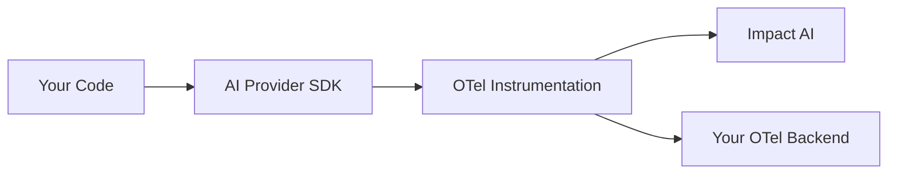

The Impact AI SDK provides automatic tracing and telemetry for your AI applications. Built on OpenTelemetry, it captures every LLM call, tool invocation, and retrieval with zero code changes.

## Key Features

<CardGroup cols={2}>
  <Card title="Auto-Instrumentation" icon="wand-magic-sparkles">
    Automatically captures traces from OpenAI, Anthropic, Azure, Google, and more
  </Card>
  <Card title="Custom Tracing" icon="route">
    Add custom spans with the `@trace` decorator for full visibility
  </Card>
  <Card title="Context Propagation" icon="link">
    Associate traces with users, sessions, and custom metadata
  </Card>
  <Card title="BYO OpenTelemetry" icon="plug">
    Works alongside existing OTel setups (Datadog, Langfuse, etc.)
  </Card>
</CardGroup>

## Supported Providers

The SDK automatically instruments these GenAI providers:

| Provider | Package | Auto-Instrumented |
|----------|---------|-------------------|
| OpenAI | `openai` | Yes |
| Azure OpenAI | `openai` / `azure-ai-inference` | Yes |
| Anthropic | `anthropic` | Yes |
| Google GenAI | `google-generativeai` | Yes |
| Google Vertex AI | `vertexai` | Yes |
| AWS Bedrock | `boto3` | Yes |
| Ollama | `ollama` | Yes |
| Mistral | `mistralai` | Yes |
| Cohere | `cohere` | Yes |
| Groq | `groq` | Yes |
| LlamaIndex | `llama-index` | Yes |
| OpenAI Agents SDK | `openai-agents` | Yes |

## How It Works

The SDK uses OpenTelemetry instrumentation to automatically capture telemetry:



1. You call your AI provider as normal
2. The instrumentation intercepts the call
3. Span data is captured (input, output, tokens, latency)
4. Traces are exported to Impact AI (and optionally your own OTel backend)

## Quick Example

```python
import os
from openai import OpenAI
from impact.sdk import init, context

# Initialize Impact AI
init(
    api_key=os.getenv("IMPACT_API_KEY"),
    api_endpoint=os.getenv("IMPACT_URL")
)

# Set context for the request
context(user_id="user_123", interaction_id="chat_001")

# Use OpenAI as normal - it's automatically traced
client = OpenAI()
response = client.chat.completions.create(
    model="gpt-4o",
    messages=[{"role": "user", "content": "Hello!"}]
)
```

## What's Captured

For each LLM call, the SDK captures:

- **Request**: Model, messages, parameters
- **Response**: Generated content, finish reason
- **Tokens**: Input, output, and reasoning tokens
- **Timing**: Start time, duration, time-to-first-token
- **Cost**: Calculated based on model pricing
- **Errors**: Exception details and stack traces

## Architecture

The SDK is designed to be lightweight and non-intrusive:

- **Zero dependencies on AI providers** — Works with whatever SDK you use
- **Minimal overhead** — Async export with batching
- **Graceful degradation** — Won't crash your app if Impact AI is unreachable
- **Thread-safe** — Works with async, threading, and multiprocessing

## Next Steps

<CardGroup cols={2}>
  <Card title="Installation" icon="download" href="/sdk/installation">
    Install and configure the SDK
  </Card>
  <Card title="Initialization" icon="play" href="/sdk/initialization">
    Configure initialization options
  </Card>
  <Card title="Custom Tracing" icon="route" href="/sdk/tracing">
    Add custom spans with decorators
  </Card>
  <Card title="Context" icon="link" href="/sdk/context">
    Associate traces with users and sessions
  </Card>
</CardGroup>
