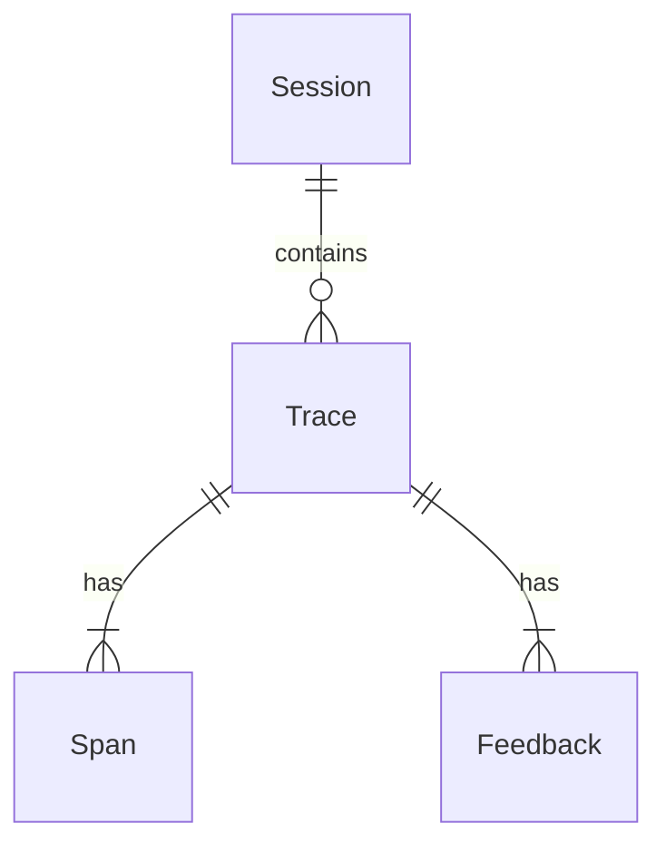

# Analyse (Orion)

Orion turns raw traces, logs, and user feedback into **actionable product insights**.  With live dashboards, deep behavioural analytics, and automated root-cause analysis, it empowers product managers and data scientists to iterate with confidence.

## Core analytics pillars

1. **Usage** – Understand *who* is using your models, *how often*, and *where* friction occurs.
2. **Quality** – Track answer correctness, hallucination rates, and adherence to policy across segments.
3. **Performance** – Monitor latency, throughput, and cost across models and prompts.
4. **Business Impact** – Correlate model performance with downstream KPIs such as conversion or revenue lift.

## Data model at a glance

<CodeGroup>

</CodeGroup>

## Interactive dashboards

- **Funnel Analysis** – Drop-off visualisation for multi-turn conversations.
- **Segment Explorer** – Create user cohorts on the fly and compare KPIs.
- **Prompt Diff** – Side-by-side comparison of prompt changes and their impact.

<Tip>
All dashboards are powered by a column-store backend, so even billion-row datasets stay snappy.
</Tip>

## Example: Investigate a spike in hallucinations

```python
from impact.analytics import Orion

o = Orion()

chart = (
    o.traces()
      .where(model="gpt-4o")
      .rolling(window="1h")
      .metric("hallucination_rate")
      .plot()
)
chart.show()
```

## Integrations

- **BI Tools** – Export datasets to Snowflake, BigQuery, or Tableau.
- **Alerting** – Push anomalies to Slack, PagerDuty, or email.
- **Notebooks** – Pull pre-cleaned dataframes into pandas or Polars for ad-hoc exploration.

## Best Practices

1. **Start with questions** – Frame hypotheses first, then use Orion to test them.
2. **Tag everything** – Rich `metadata` tags enable powerful filtering later.
3. **Automate alerts** – Don’t wait for a KPI to fall off a cliff; subscribe to anomalies.
4. **Close the loop** – Feed insights back to Laila (Control) and Sage (Test) for rapid iteration.

## Further Reading

- [Analytics DSL reference](/api-reference/analytics-dsl)
- [Case Study: 30% Latency Reduction with Orion](https://impact.ai/resources/case-studies/orion)
